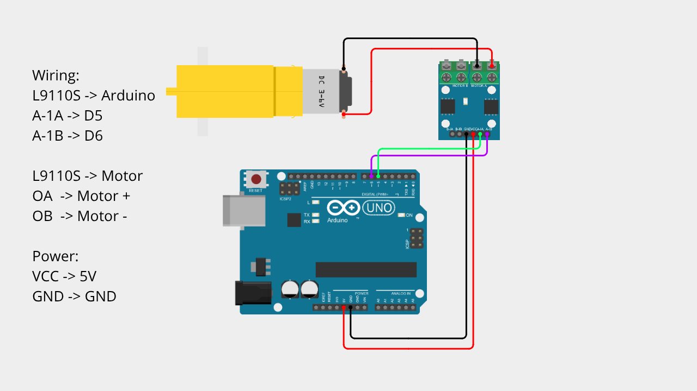

# Arduino DC Motor Control Using L9110S Driver

A beginner-friendly Arduino project demonstrating how to control a DC motor using the L9110S motor driver module.

This project allows the motor to rotate forward, reverse, and stop using simple digital control.

---

## 📌 Project Overview

A DC motor cannot be driven directly from Arduino pins due to current limitations.

The L9110S motor driver module acts as an interface between Arduino and the motor, allowing safe and efficient control.

By controlling two digital input pins, Arduino can:

- Rotate motor forward  
- Rotate motor backward  
- Stop the motor  

This project is designed without any external library, making it perfect for beginners to understand basic motor control.

---

## 🧰 Components Required

- Arduino Uno / Nano  
- L9110S Motor Driver Module  
- DC Motor  
- Jumper Wires  
- Breadboard (optional)  

---

## 🔌 Wiring Connections

| L9110S Driver | Arduino |
|--------------|----------|
| A-1A         | Pin 5    |
| A-1B         | Pin 6    |
| VCC          | 5V       |
| GND          | GND      |

| L9110S Driver | Motor |
|--------------|--------|
| OA           | Motor + |
| OB           | Motor - |

---

## 📷 Wiring Diagram

> Make sure your wiring matches the diagram above before uploading the code.

---

## 💻 Arduino Code

You can download the Arduino sketch here:

[Download Arduino Code](Arduino_DC_Motor_L9110S.ino)

Or open the `.ino` file directly inside this repository.

---

## 🚀 Getting Started

1. Connect all components according to the wiring table.
2. Upload the provided Arduino sketch.
3. The motor will:
   - Rotate forward  
   - Stop  
   - Rotate backward  
   - Stop again  
4. Observe the motor behavior.

---

## 🧠 Learning Concepts

This project helps you understand:

- Basic DC motor control
- Motor driver usage (L9110S)
- Digital output control
- Direction control logic (H-bridge concept)
- Writing clean and modular Arduino code

---

## 🎥 Video Tutorial

Watch the full step-by-step tutorial on YouTube:

In this video, you will see:
- Complete wiring demonstration  
- Code explanation  
- Motor forward and reverse test  
- Real-time project demo  

If this project helps you, consider subscribing for more beginner-friendly Arduino tutorials 🚀

---

## 📄 License

This project is open-source and free to use for educational purposes.

---

Happy Coding 🚀
